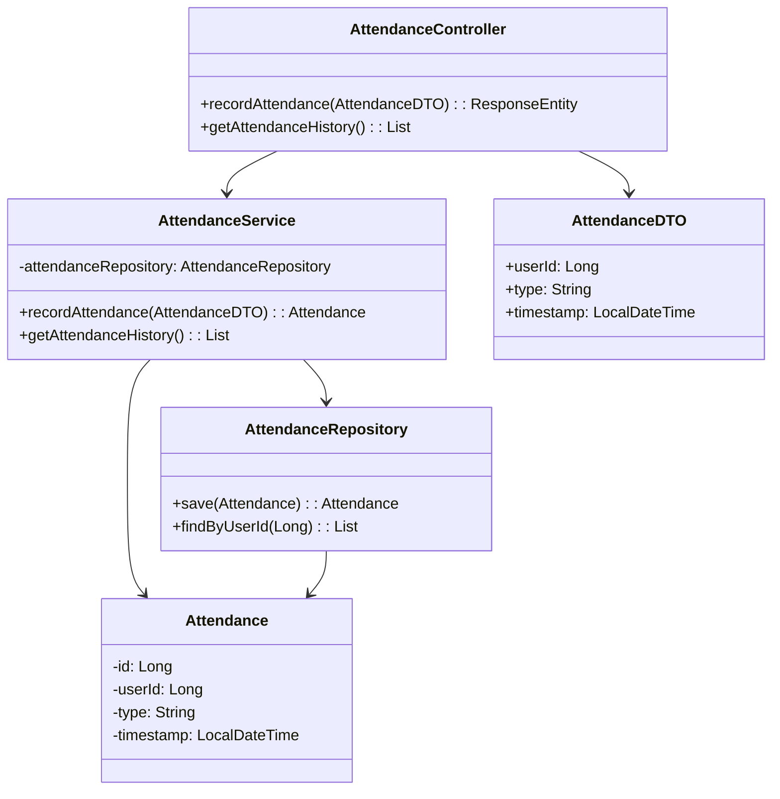
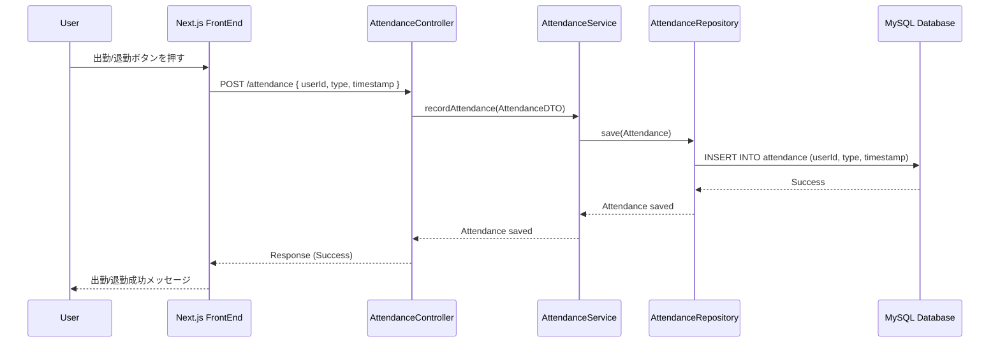
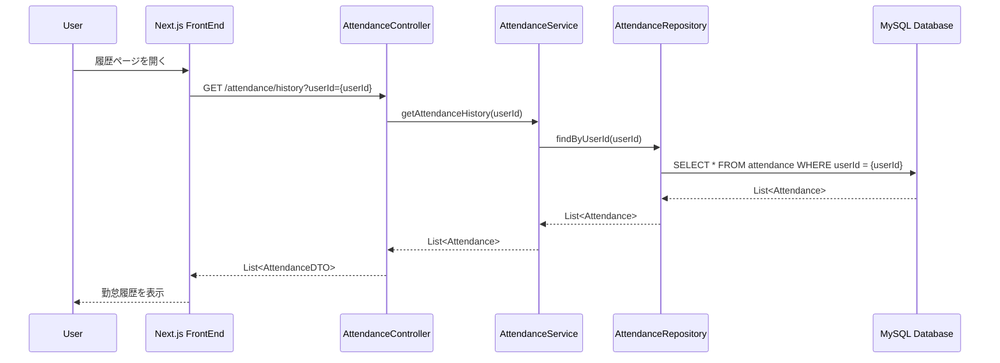
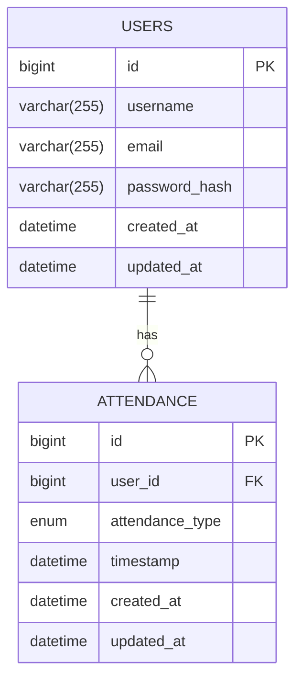

# クラス図

```mermaid
classDiagram
    class AttendanceController {
        +recordAttendance(AttendanceDTO): ResponseEntity
        +getAttendanceHistory(): List<AttendanceDTO>
    }
    
    class AttendanceService {
        -attendanceRepository: AttendanceRepository
        +recordAttendance(AttendanceDTO): Attendance
        +getAttendanceHistory(): List<Attendance>
    }
    
    class Attendance {
        -id: Long
        -userId: Long
        -type: String
        -timestamp: LocalDateTime
    }
    
    class AttendanceRepository {
        +save(Attendance): Attendance
        +findByUserId(Long): List<Attendance>
    }
    
    class AttendanceDTO {
        +userId: Long
        +type: String
        +timestamp: LocalDateTime
    }
    
    AttendanceController --> AttendanceService
    AttendanceService --> AttendanceRepository
    AttendanceService --> Attendance
    AttendanceRepository --> Attendance
    AttendanceController --> AttendanceDTO
```

# シーケンス図
## 出勤/退勤記録

```mermaid
sequenceDiagram
    participant User
    participant FrontEnd as Next.js FrontEnd
    participant Controller as AttendanceController
    participant Service as AttendanceService
    participant Repository as AttendanceRepository
    participant DB as MySQL Database

    User ->> FrontEnd: 出勤/退勤ボタンを押す
    FrontEnd ->> Controller: POST /attendance { userId, type, timestamp }
    Controller ->> Service: recordAttendance(AttendanceDTO)
    Service ->> Repository: save(Attendance)
    Repository ->> DB: INSERT INTO attendance (userId, type, timestamp)
    DB -->> Repository: Success
    Repository -->> Service: Attendance saved
    Service -->> Controller: Attendance saved
    Controller -->> FrontEnd: Response (Success)
    FrontEnd -->> User: 出勤/退勤成功メッセージ
```

## 出勤/退勤履歴取得

```mermaid
sequenceDiagram
    participant User
    participant FrontEnd as Next.js FrontEnd
    participant Controller as AttendanceController
    participant Service as AttendanceService
    participant Repository as AttendanceRepository
    participant DB as MySQL Database

    User ->> FrontEnd: 履歴ページを開く
    FrontEnd ->> Controller: GET /attendance/history?userId={userId}
    Controller ->> Service: getAttendanceHistory(userId)
    Service ->> Repository: findByUserId(userId)
    Repository ->> DB: SELECT * FROM attendance WHERE userId = {userId}
    DB -->> Repository: List<Attendance>
    Repository -->> Service: List<Attendance>
    Service -->> Controller: List<Attendance>
    Controller -->> FrontEnd: List<AttendanceDTO>
    FrontEnd -->> User: 勤怠履歴を表示
```

## DB設計

```mermaid
erDiagram
    USERS ||--o{ ATTENDANCE : "has"
    USERS {
        bigint id PK
        varchar(255) username
        varchar(255) email
        varchar(255) password_hash
        datetime created_at
        datetime updated_at
    }
    ATTENDANCE {
        bigint id PK
        bigint user_id FK
        enum attendance_type
        datetime timestamp
        datetime created_at
        datetime updated_at
    }
```